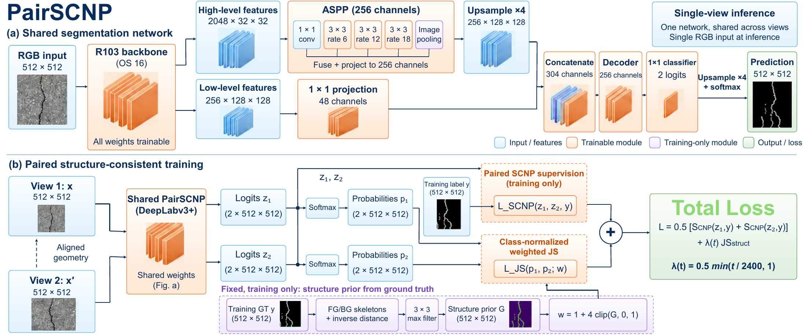
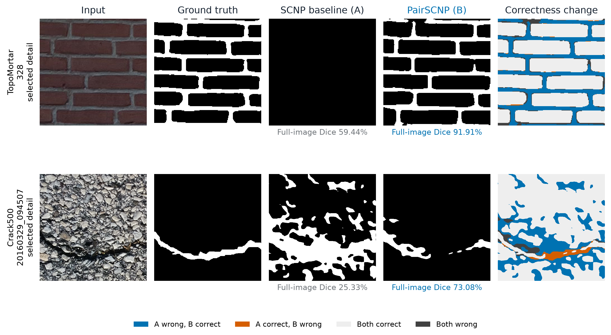
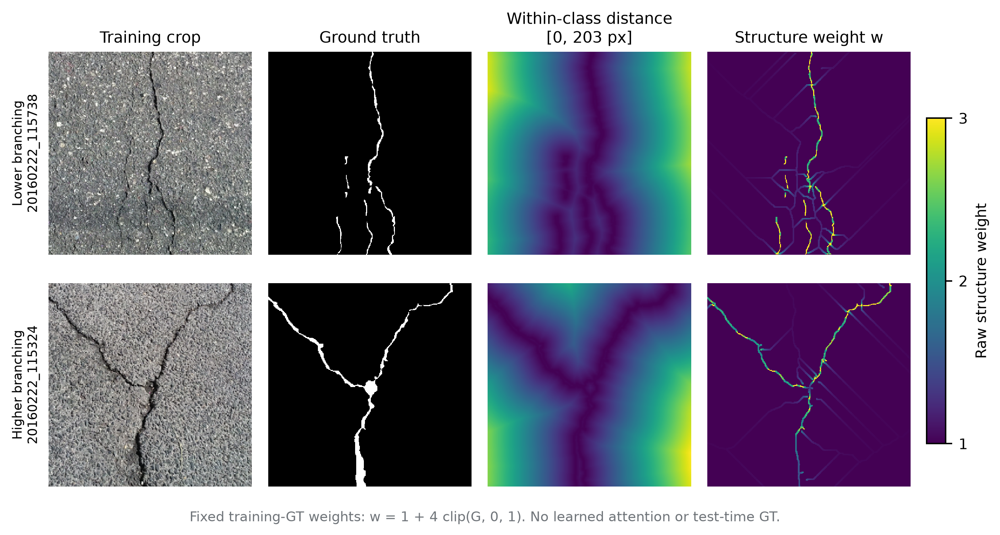
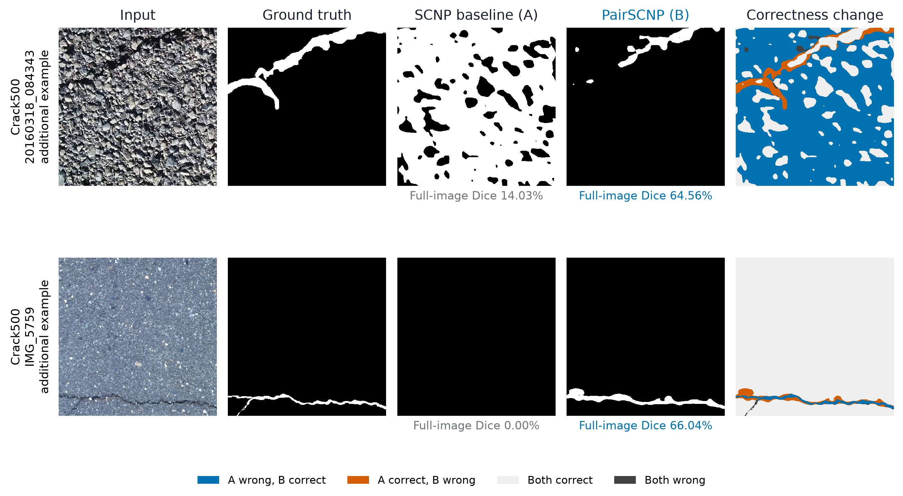
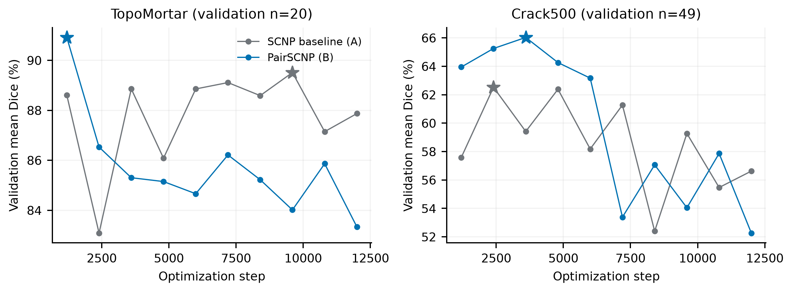

# PairSCNP

**Paired-view consistency for structure-aware crack segmentation.**

PairSCNP trains one shared DeepLabv3+ segmentation network on two spatially aligned views. Each view receives Same-Class Neighbor Penalization (SCNP) supervision, while a ground-truth-derived structural prior weights agreement between their class probabilities. Inference uses a single RGB image and the same segmentation network.



## Method

The baseline and PairSCNP use the same ImageNet-initialized DeepLabv3+ R103-OS16 architecture. R103 is Detectron2's DeepLab stem configuration with a ResNet depth field of 101. All network weights are trainable.

- **Aligned views:** a common spatially augmented crop and a second view with photometric changes and rectangular occlusions.
- **SCNP supervision:** the upstream SCNP cross-entropy plus Dice loss is applied to each view's logits and averaged.
- **Structural consistency:** foreground/background skeletons, inverse regional distance and a 3×3 maximum filter produce a fixed prior `G`. Pixel weights are `w = 1 + 4 clip(G, 0, 1)`. Jensen–Shannon divergence is normalized separately within each present ground-truth class and image, then averaged.

```text
L = 0.5 [L_SCNP(z1, y) + L_SCNP(z2, y)] + lambda(t) L_JS
lambda(t) = 0.5 min(t / 2400, 1)   # default 12000-step schedule
```

The prior and target masks are used only during training. Single-image inference uses neither labels nor a consistency branch.

## Repository layout

```text
pairscnp/       shared model, augmentations, structure loss, data and metrics
  author_deeplab/  upstream SCNP loss and DeepLab support modules
configs/        architecture, backbone download metadata and training defaults
scripts/        data preparation, downloads, training, evaluation and prediction
data/           dataset manifests and download guides; no dataset binaries
Figures/        framework and qualitative illustrations
results/        archived per-image reference metrics and evaluation IDs
tests/          CPU checks for losses, geometry, augmentation and metrics
third_party/    upstream license notices
```

## Installation

Training targets **Linux (Ubuntu 22.04 or newer), Python 3.11, a BF16-capable NVIDIA GPU and CUDA 12.8**. The recorded numerical environment uses PyTorch 2.9.1 and TorchVision 0.24.1. Install a CUDA-enabled PyTorch build before Detectron2:

```bash
python3.11 -m venv .venv
source .venv/bin/activate
python -m pip install --upgrade pip setuptools wheel
python -m pip install torch==2.9.1 torchvision==0.24.1 \
  --index-url https://download.pytorch.org/whl/cu128
python -m pip install -r requirements.txt
python -m pip install --no-build-isolation \
  'git+https://github.com/facebookresearch/detectron2.git@a2f4a8771ab77e8411c26b27f24f9489a28a2453'
```

Detectron2 may require a compatible C++ compiler and CUDA toolkit. The pinned dependency above provides a reproducible installation target; GPU training with this packaged release has not been rerun. The original head/loss modules are retained, and CPU numerical checks cover the core PairSCNP operations.

Run all commands below from the repository root. No original server path is required.

## Datasets and initialization

Follow [TopoMortar preparation](data/topomortar/README.md) and [Crack500 preparation](data/crack500/README.md). The manifests preserve the recorded split membership and image/mask hashes. A preparation command validates downloaded files and writes local caches plus a `prepared_manifest.json`.

```bash
python scripts/download_assets.py topomortar
python scripts/prepare_data.py --dataset topomortar --raw-root data/topomortar/raw

# Download and extract Crack500 using the dataset guide first.
python scripts/prepare_data.py --dataset crack500 --raw-root /path/to/CRACK500

# Public ImageNet backbone initialization, verified with SHA256.
python scripts/download_assets.py backbone
```

Raw datasets, derived caches and trained weights are excluded from Git. The public backbone is initialization only; it is not a trained PairSCNP checkpoint. Final experiment checkpoints are not included in this release.

## Training

```bash
# PairSCNP
python scripts/train.py --dataset topomortar --method pairscnp \
  --output runs/topomortar_pairscnp_s0

# Matched single-view SCNP baseline
python scripts/train.py --dataset topomortar --method scnp \
  --output runs/topomortar_scnp_s0

# Second dataset
python scripts/train.py --dataset crack500 --method pairscnp \
  --output runs/crack500_pairscnp_s0
```

Defaults are 12,000 optimizer updates, microbatch 2 × accumulation 2, AdamW with learning rate 0.001 and weight decay 0.1, cosine decay, gradient clipping at 12 and seed 0. Validation runs every 1,200 updates. The largest validation mean Dice selects `best.pt`; all runs continue to the requested final update. Changing `--steps` proportionally rescales the augmentation curriculum and consistency warmup. Use a new output directory for each run.

The release retains the original paired forward pass and the mean of both SCNP losses. It removes unrelated model branches and experiment controllers, and replaces server-specific resource paths with portable manifests. Logs, selected validation scores, source hashes and checkpoint hashes are saved with each new run. There is no exact-resume command; interrupted training should use a new run directory.

## Evaluation and inference

```bash
# Replays validation, checks the locked checkpoint and evaluates the full test split.
python scripts/evaluate.py --run runs/topomortar_pairscnp_s0 \
  --output outputs/topomortar_full_test

# Explicitly evaluate the image IDs underlying the archived reference table.
python scripts/evaluate.py --run runs/topomortar_pairscnp_s0 \
  --reported-ids --output outputs/topomortar_reference_ids

# Single RGB image, no labels required.
python scripts/predict.py --checkpoint runs/topomortar_pairscnp_s0/best.pt \
  --image /path/to/image.png --output outputs/prediction.png
```

Inference caps the longer side at 1024 pixels, averages probabilities from 512×512 windows with stride 384, then restores the original image resolution and thresholds foreground probability at 0.5. There is no test-time augmentation or morphological cleanup. Evaluation reports foreground Dice, IoU, clDice and Betti-number errors, using eight-connected foreground and four-connected background.

## Reference A/B results

These archived, single-seed results cover the **70 TopoMortar and 50 Crack500 images listed in [the evaluation manifest](results/reported_evaluation_ids.json)**. They are not full-test means. The evaluator defaults to the complete test split; [results documentation](results/README.md) explains the distinction and checkpoint selection.

| Dataset | Method | Dice ↑ | IoU ↑ | clDice ↑ | β₀ error ↓ | β₁ error ↓ |
|---|---|---:|---:|---:|---:|---:|
| TopoMortar | SCNP | 70.90 | 58.91 | 73.14 | **23.83** | 20.94 |
| TopoMortar | PairSCNP | **74.49** | **62.44** | **77.60** | 26.31 | **10.11** |
| Crack500 | SCNP | 51.45 | 38.59 | 59.67 | 13.32 | 12.82 |
| Crack500 | PairSCNP | **59.65** | **45.56** | **68.34** | **10.70** | **9.36** |

Pixel scores are percentages. PairSCNP improves the listed Dice and clDice scores on both datasets, while TopoMortar β₀ error increases. This A/B comparison changes the complete paired-training recipe and does not isolate the contribution of each augmentation or loss component.

## Qualitative examples



Selected TopoMortar and Crack500 regions. Blue pixels indicate baseline errors corrected by PairSCNP; orange pixels indicate new errors. Dice labels refer to each complete source image.



Fixed training-label-derived weights for two Crack500 examples. Both maps share a 1–3 display scale; they are not learned attention maps.



Additional Crack500 examples show false-positive suppression and crack recovery, including remaining local errors. These selected cases are illustrations rather than dataset-wide estimates.



Validation mean Dice every 1,200 updates. Stars mark selected checkpoints: baseline/PairSCNP at 9,600/1,200 on TopoMortar and 2,400/3,600 on Crack500. All runs complete 12,000 updates; selection uses validation scores.

## Checks

Core tests can run on CPU without Detectron2:

```bash
python -m pip install -r requirements-dev.txt
python -m pytest tests -q
```

Tests cover JS symmetry and class normalization, finite gradients through both predictions, upstream SCNP loss, label-derived geometry, topology metric conventions and spatially aligned augmentations. Full training and dataset-level evaluation require the downloaded data, pretrained initialization and CUDA environment.

## Acknowledgments and licensing

This implementation builds on [SCNP](https://github.com/jmlipman/SCNP-SameClassNeighborPenalization), [Detectron2 DeepLab](https://github.com/facebookresearch/detectron2/tree/main/projects/DeepLab), [TopoMortar](https://github.com/jmlipman/TopoMortar) and [Crack500](https://github.com/fyangneil/pavement-crack-detection). Please cite the corresponding upstream work when using their code or data.

PairSCNP additions are distributed under [MIT](LICENSE). Upstream code retains its original notices and licenses in [third_party](third_party/README.md). Dataset and pretrained-weight terms are governed by their respective sources.
